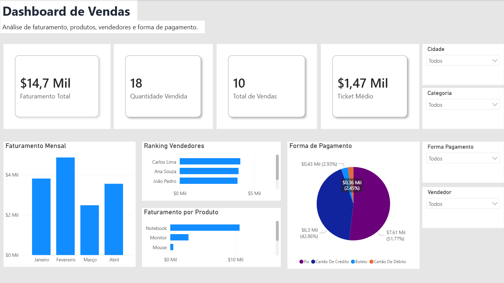

# Dashboard de Vendas com Python e Power BI



Este projeto foi desenvolvido com o objetivo de demonstrar conhecimentos básicos em análise de dados, tratamento de dados com Python, criação de relatórios no Power BI e versionamento com Git/GitHub.

## Objetivo do projeto

Criar um dashboard de vendas a partir de uma base de dados simulada, passando pelas etapas de tratamento, organização, análise e visualização dos dados.

O projeto demonstra habilidades em:

- Tratamento de dados com Python
- Modelagem simples de dados
- Criação de indicadores no Power BI
- Desenvolvimento de visualizações interativas
- Versionamento com Git e GitHub

## Tecnologias utilizadas

- Python
- Pandas
- Jupyter Notebook
- Power BI
- Git
- GitHub

## Estrutura do projeto

```text
dashboard-vendas-powerbi-python/
│
├── dados/
│   ├── vendas_brutas.csv
│   └── vendas_tratadas.csv
│
├── imagens/
│   └── print_dashboard.png
│
├── notebooks/
│   └── tratamento_dados.ipynb
│
├── powerbi/
│   └── dashboard_vendas.pbix
│
├── .gitignore
├── README.md
└── requirements.txt
```

## Etapas realizadas
1. Criação da base de dados

Foi utilizada uma base de dados simulada contendo informações de vendas, como data da venda, vendedor, produto, categoria, cidade, estado, quantidade, preço unitário e forma de pagamento.

2. Tratamento dos dados com Python

O tratamento foi realizado com a biblioteca Pandas.

Foram feitas as seguintes etapas:

Leitura da base bruta em CSV
Conversão da coluna de data
Criação das colunas de ano, mês e nome do mês
Criação da coluna de faturamento
Padronização dos dados textuais
Remoção de registros duplicados
Exportação da base tratada em CSV
3. Modelagem dos dados

A base foi preparada para análise no Power BI, utilizando campos como:

Data da venda
Produto
Categoria
Vendedor
Cidade
Forma de pagamento
Quantidade
Faturamento
4. Criação do dashboard no Power BI

No Power BI, foram criados indicadores e gráficos para acompanhar o desempenho das vendas.

Principais indicadores:

Faturamento total
Quantidade vendida
Total de vendas
Ticket médio

Visualizações criadas:

Faturamento mensal
Faturamento por produto
Ranking de vendedores
Faturamento por forma de pagamento
Filtros por cidade, categoria, forma de pagamento e vendedor

## Medidas DAX utilizadas

Faturamento Total = SUM(vendas_tratadas[faturamento])
Quantidade Vendida = SUM(vendas_tratadas[quantidade])
Total de Vendas = COUNT(vendas_tratadas[id_venda])
Ticket Médio = DIVIDE([Faturamento Total], [Total de Vendas])

## Como executar o projeto

Clone o repositório:
git clone https://github.com/diegodossantos001-max/dashboard-vendas-powerbi-python.git
Acesse a pasta do projeto:
cd dashboard-vendas-powerbi-python
Instale as dependências:
pip install -r requirements.txt
Execute o notebook:
notebooks/tratamento_dados.ipynb
Abra o arquivo do Power BI:
powerbi/dashboard_vendas.pbix

## Conclusão

Este projeto demonstra conhecimentos iniciais em análise de dados, tratamento de dados com Python, criação de indicadores no Power BI e versionamento de projeto com Git/GitHub.

A proposta simula um fluxo simples de análise de dados, desde a preparação da base até a criação de um dashboard final para apoio à tomada de decisão.